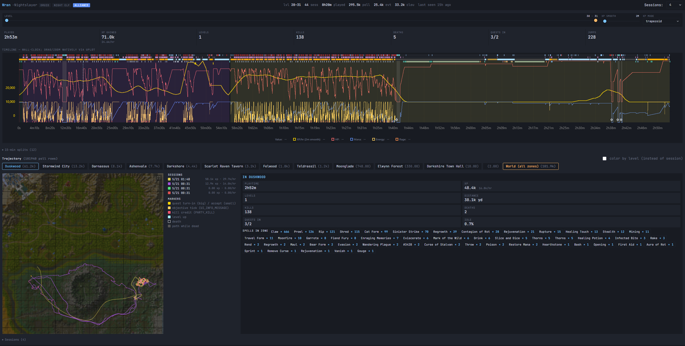

# Forestry
WoW Gameplay Logging Toolkit

## Architecture
WoW doesn't have any APIs to exfiltrate data and I didn't want to do anything shady the way it works is it's just an addon like Auctioneer but it builds a database of all of your movements and casts and things. The size of this grows pretty quickly and it would start slowing down your WoW noticably after a few days of playtime accumulated. That's why there's a second part that runs outside of WoW and watches the /WTF/ folder. Every time you're logged out for more than a couple seconds the data is ingested into a database and then next load the addon garbage collects and deletes all the values that are confirmed to be in the external DB so you shouldn't lose data ever, and as long as you log off every once in a while and the server is on in the BG it should never log a problematic amount of stuff.

- **Lumberjack** - wow addon that logs data
  - `/lj help` 
- **Ranger** - wow addon that datamines strings for the UI
  - no interactivity, just runs alongside Lumberjack and updates the `internal_id -> english` dictionary so that any event you've seen has a human readable name
- **Sawmill** - main process that manages the database, archive, and ingest
  - has a built in visualization server that runs in the browser at localhost:3333
  - gives you a REST API for the data if you want to do things with it yourself
